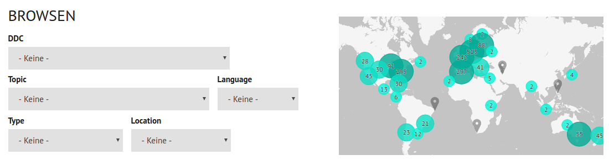

---
title: Übersicht von Systemen zur Wissensorganisation
subtitle: Projektvorstellung (BIM & BMI)
author: Dr. Jakob Voß
date: Dienstag, 13.12.2016
header-includes:
    - '\setbeamersize{text margin left=10pt,text margin right=10pt}'
...

# Wer ist dieser Jakob Voß?

* Verbundzentrale des GBV (VZG), Göttingen

    * Etwa 75 Angestellte

    * Wir nehmen auch HsH Praktikanten & Absolventen!\
      (zuletzt Moritz Horn 2016, Jana Maria Agne 2015)

* Stabstelle Forschung & Entwicklung

* Lehre an der HsH
    * Digitale Bibliothek / Open Access (SS 2014, WS 2008/09)
    * Projektseminar SS 2014
    
# Systeme zur Wissensorganisation

* **Klassifikationen:**
  Regensburger Verbundklassifikation (RVK),
  Dewey Decimal Classification (DDC),
  Star Trek Planetenklassifikation...

* **Thesauri:**
  Medical Subject Headings (MeSH), AGROVOC, Eurovoc... 

* **Ontologien:**
  Dublin Core (DC), Gene Ontology (GO)...

* **Normdateien:**
  Gemeinsame Normdatei (GND), ORCID... 

* ...

\vfill
$\rightarrow$ \textit{LV Informationserschließung (BIM)}\
$\rightarrow$ \textit{LV Ausgew. Fragen der Med. Dokumentation \& Med. Informatik (BMI)}

# BARTOC.org

Basel Register of Thesauri, Ontologies & Classifications

* Katalogdatenbank von Systemen zur Wissensorganisation
* Derzeit mehr als 2500 Einträge
* **Datengrundlage im Projekt**
    * Art des System, Fachgebiete, Sprachen, URL, Herausgeber, Lizenz...

\vfill

\

# Ziel des Projekt

**Übersicht von Systemen zur Wissensorganisation**

* In welchen Bereichen werden welche Systeme verwendet?

* Wie können die Systeme genutzt werden?\
  (Verfügbarkeit in welcher Form, unter welcher Lizenz...)

# Was ist zu tun? Was gibt es zu lernen?

* **Katalogisieren** von weiteren Systemen in BARTOC

* **Datenqualität** der Beschreibung in BARTOC verbessern

    * vereinheitlichen, ergänzen, korrigieren...

* **Informationsvisualisierung**
  
    * Statistiken und Infografiken erstellen
    * Informationsmaterial (Flyer, Poster...)

* **Öffentlichkeitsarbeit**
    
    * Kontakt mit Herausgebern um Angaben in BARTOC zu verbessern
    * Ergebnisse angemessen Präsentieren

\vfill
\centering
$\rightarrow$ \textit{Schwerpunkt je nach Teilnehmer-Interessen!}
\vfill
\textit{\small BMI-Schwerpunkt Medizinformatik / Manag. GW möglich}
