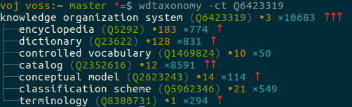

---
title: Wikidata-Einführung für Wissensorganisationssysteme
author:
  - Jakob Voß
institute: Verbundzentrale des GBV (VZG)
date: 2017-03-20
lang: de
...

# Was ist Wikidata?

Wikipedia
  : freie Enzyklopädie in Form eines Wikis

Wikidata
  : freie Datenbank in form eines Wikis

Beide
 
* betrieben von der Wikimedia Foundation
* basieren auf der MediaWiki Wiki-Software

# Ziele von Wikidata

1. Wikipedia-Sprachversionen miteinander verknüpfen
2. Daten aus Wikipedia-Infoboxen zentral verwalten
3. Komplexe Abfragen

*"Structure the sum of all human knowledge"*

# Bestandteile von Wikidata

* Items (`Q...`)
    * z.B. [Q22279816](http://www.wikidata.org/entity/Q22279816) "BARTOC"
    * z.B. [Q2013](http://www.wikidata.org/entity/Q2013) "Terminologieverzeichnis" 
* Properties (`P...`)
    * z.B. [P31](http://www.wikidata.org/entity/P31) "ist ein(e)"
    * z.B. [P865](http://www.wikidata.org/entity/P865) "offizielle Webseite"
    * z.B. [P2689](http://www.wikidata.org/entity/P2689) "BARTOC-ID"
* Normale Wiki-Seiten
    * Hilfe, Diskussionen...

# Bestandteile einer Wikidata-Aussage

](wikidata-statement.png)

# Wikidata-Inhalte

* Items sind miteinander verknüpft
* Verschiedenartike Darstellungen und Abfragen möglich
    * <http://www.wikidata.org/entity/Q22279816>
    * <https://tools.wmflabs.org/sqid/#/view?id=Q22279816>
    * <https://tools.wmflabs.org/reasonator/?&lang=de&q=22692845>
    * [Histropedia](http://histropedia.com/timeline/2j2stpg9bg0t/Pixar-animated-films)

# Beispiel

# Beispiel

# Beispiel für vereinfachte Bearbeitung

* mix'n'match

# Übung

* Hochschule Hannover / Fakultät III
* Professoren des Bereichs Informationsmanagement
* Datensatz anlegen, mit Basisinformationen füllen und mit Normdaten
  (GND, ORCID...) verknüpfen

# Abfragen von Wikidata

* Komplexe Abfragen mittels SPARQL
  <http://query.wikidata.org/>

* Für uns relevante Beispiele unter
  <https://www.wikidata.org/wiki/Wikidata:WikiProject_KOS>

